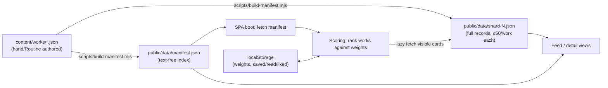

# Architecture

Static SPA, no backend. Content is authored/curated as JSON in the repo, compiled to a lightweight index + shards, and served as static files from GitHub Pages. All personalization happens client-side in `localStorage`.

## Data flow



Boot sequence: SPA fetches `manifest.json` once, scores every entry against the reader's `localStorage` weights, builds the feed order, then lazy-fetches only the shard(s) containing the cards currently in view. Nothing is fetched per-scroll except shards.

## Folder layout

```
.github/workflows/          deploy.yml (Pages on push to main), ci.yml (lint+test+validate on every push)
.claude/skills/curate/      SKILL.md — batch curation checklist for the Routine
content/works/              hand/Routine-authored Work JSON, one file per work — source of truth
scripts/                    build-manifest.mjs, validate-content.mjs, fetch-*.mjs, report-coverage.mjs
public/data/                generated: manifest.json + shard-N.json — never hand-edit
src/lib/types/              Work type + zod schema (z.infer'd), shared by scripts and app
src/lib/stores/             persisted localStorage stores (weights, saved/read/liked)
src/lib/scoring/            pure scoring functions, vitest-covered
src/lib/components/         WorkCard, steering chips, master-notes sheet, etc.
src/views/                  Feed, Detail, Library, Onboarding
docs/                       this doc set — source of truth for conventions
tests/                      vitest specs
```

## Manifest vs. shards

- **`manifest.json`** — one entry per work, text-free: `id, title, author, year, era, type, form, themes[], tags[], difficulty, length{unit,value}, textPolicy, shard`. Loaded in full on boot; small enough to keep in memory and search with `minisearch`.
- **`shard-N.json`** — full `Work` records (including `text`/`excerpt`, `masterNotes`, links), capped at **50 works per shard**. `manifest.shard` tells the app which file to fetch for a given work. Sharding keeps any single fetch small and lets the catalog grow without a heavier first load.
- Books are always `textPolicy: excerpt` in shards — full novels are never shipped.

## GitHub Pages base path

Vite is configured with `base: '/well-read/'`. Every data fetch in the app uses `` `${import.meta.env.BASE_URL}data/manifest.json` `` (never a hardcoded `/data/...` path), so the app works identically in dev, preview, and under the Pages subpath.

## Workflows

| Workflow | Trigger | Does |
|---|---|---|
| `deploy.yml` | push to `main` | build, `actions/upload-pages-artifact`, `actions/deploy-pages` |
| `ci.yml` | every push | `npm run lint`, `npm test`, `npm run validate:content` |

## Routine commit flow

The scheduled Curation Routine runs `.claude/skills/curate/SKILL.md` in a fresh session: source candidates, write `content/works/*.json`, run `validate:content` → `build:manifest` → `npm test`, then commit directly to `main` as `curate: batch <date> (<n> works)` and push. `ci.yml` is the backstop since the commit is unreviewed. On repeated validation failure the Routine stops and leaves the tree uncommitted rather than force a bad batch through.

## See also

- `docs/content-schema.md` — `Work` type, validation rules, manifest field list, example
- `docs/open-source-reuse.md` — chosen libraries and data sources
- `docs/orchestration.md` — how work packages get executed
- `docs/editorial-policy.md`, `docs/recommendation-design.md`, `docs/design-system.md`
