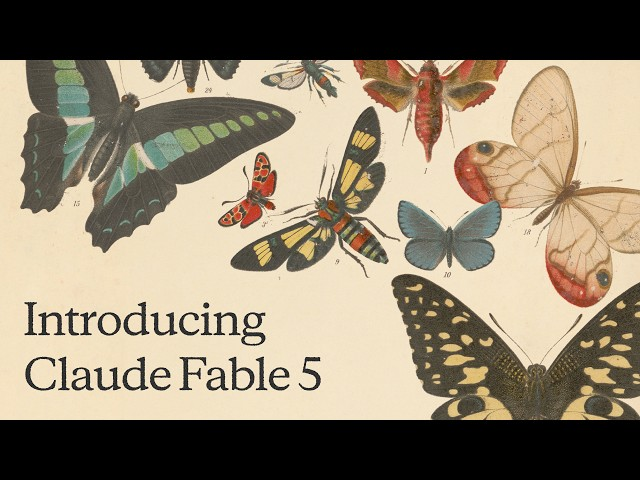

# Design System — well-read

Source of truth for palette, type, motion, components, and accessibility. Every UI work package (Phase 2+) implements against this file; do not improvise tokens elsewhere.

## 1. Reference and feel



The reference is an aged cream paper ground carrying a vintage natural-history plate: a dozen butterflies and moths, each specimen numbered in tiny italic figures as if catalogued for a folio. A large, soft humanist serif sets the title in a warm near-black ink that never reads as flat digital black. Every note of colour in the frame — teal, vermilion, ochre, sky blue, sepia — comes from the specimens themselves; the paper and type stay neutral so the illustrations do the chromatic work.

**One-line brief:** a 19th-century natural-history folio that happens to be a fast modern app.

## 2. Tokens

Tokens are CSS custom properties layered on top of [open-props](https://open-props.style) (spacing, easing, and shadow primitives) rather than a replacement for it — import open-props first, then this sheet, so the semantic names below can fall back to literal values if open-props is absent. Raw palette tokens are the specimen colours; semantic tokens are what components actually consume.

```css
:root {
  /* --- Raw palette: paper / ink / sepia --- */
  --paper-100: #F8F2E7;   /* lightest — app background */
  --paper-200: #F3EBDD;   /* base paper — card surfaces */
  --paper-300: #E8DCC6;   /* deepest — raised surfaces, pressed states */
  --ink-900:   #1F1B16;   /* primary text, never pure black */
  --sepia-600: #6B5A46;   /* muted text */
  --sepia-300: #D9C9AE;   /* hairline borders, dividers */

  /* --- Raw palette: specimen accents (each with a soft tint) --- */
  --teal-500:      #3F8F8A;
  --teal-tint:      #E4EFEC;
  --teal-text:      #2A6D69;  /* AA-safe darkened variant for small text */
  --vermilion-500: #C8452B;
  --vermilion-tint: #F5E4DE;
  --vermilion-text: #A83A24;  /* AA-safe darkened variant for small text */
  --ochre-500:     #D8A43A;
  --ochre-tint:     #F7EDD8;
  --ochre-text:     #7F5A15;  /* AA-safe darkened variant for small text */
  --sky-500:       #7FA8C9;
  --sky-tint:       #E6EEF4;
  --sky-text:       #2F5C7D;  /* AA-safe darkened variant for small text */

  /* --- Semantic surfaces & text --- */
  --surface:        var(--paper-100);
  --surface-raised:  var(--paper-200);
  --surface-pressed: var(--paper-300);
  --text:           var(--ink-900);
  --text-muted:      var(--sepia-600);
  --hairline:        var(--sepia-300);

  /* --- Semantic accents: one family per card type --- */
  --accent-poem:        var(--teal-500);
  --accent-poem-tint:    var(--teal-tint);
  --accent-poem-text:    var(--teal-text);
  --accent-story:       var(--vermilion-500);
  --accent-story-tint:   var(--vermilion-tint);
  --accent-story-text:   var(--vermilion-text);
  --accent-book:        var(--ochre-500);
  --accent-book-tint:    var(--ochre-tint);
  --accent-book-text:    var(--ochre-text);
  --accent-saved:       var(--sky-500);
  --accent-saved-tint:   var(--sky-tint);
  --accent-saved-text:   var(--sky-text);

  /* --- Radii --- */
  --radius-sm: 6px;   /* chips, badges */
  --radius-md: 12px;  /* cards, buttons */
  --radius-lg: 20px;  /* sheets, modals */

  /* --- Shadows: soft, warm-tinted, never grey --- */
  --shadow-sm: 0 1px 2px rgba(31, 27, 22, 0.06);
  --shadow-md: 0 4px 16px rgba(31, 27, 22, 0.08), 0 1px 2px rgba(31, 27, 22, 0.05);
  --shadow-lg: 0 12px 32px rgba(31, 27, 22, 0.12), 0 2px 6px rgba(31, 27, 22, 0.06);

  /* --- Spacing scale (maps onto open-props --size-*) --- */
  --space-1: 4px;
  --space-2: 8px;
  --space-3: 12px;
  --space-4: 16px;
  --space-5: 24px;
  --space-6: 32px;
  --space-7: 48px;
  --space-8: 64px;

  /* --- Motion --- */
  --ease-out-soft: cubic-bezier(.2, .7, .2, 1);
  --duration-fast: 150ms;
  --duration-base: 200ms;
  --duration-slow: 250ms;
}

/* --- Dark mode: warm charcoal paper, same accents desaturated ~15% --- */
[data-theme="dark"] {
  --paper-100: #1C1915;
  --paper-200: #221E18;
  --paper-300: #2A251E;
  --ink-900:   #F0E6D6;   /* now the light "ink" text colour */
  --sepia-600: #B8A78C;
  --sepia-300: #3A342B;

  --teal-500:      #4E938E;  /* ~15% desaturated + lightened for dark ground */
  --teal-tint:      #263433;
  --teal-text:      #7FC4BE;
  --vermilion-500: #C05C42;
  --vermilion-tint: #332420;
  --vermilion-text: #E06A4A;
  --ochre-500:     #C9A150;
  --ochre-tint:     #332B1C;
  --ochre-text:     #D8A43A;
  --sky-500:       #82A6C4;
  --sky-tint:       #232A31;
  --sky-text:       #9CC0DD;

  --surface:        var(--paper-100);
  --surface-raised:  var(--paper-200);
  --surface-pressed: var(--paper-300);
  --text:           var(--ink-900);
  --text-muted:      var(--sepia-600);
  --hairline:        var(--sepia-300);

  --shadow-sm: 0 1px 2px rgba(0, 0, 0, 0.30);
  --shadow-md: 0 4px 16px rgba(0, 0, 0, 0.36), 0 1px 2px rgba(0, 0, 0, 0.24);
  --shadow-lg: 0 12px 32px rgba(0, 0, 0, 0.45), 0 2px 6px rgba(0, 0, 0, 0.28);
}
```

## 3. Typography

| Role | Family | Notes |
|---|---|---|
| Display / titles | **Fraunces** | optical size axis `on` (`font-optical-sizing: auto`), variable weight 400–600; self-hosted woff2 in `public/fonts/fraunces/` |
| Body / work text | **Newsreader** | italic axis for poem stanzas and pull-quotes; self-hosted woff2 in `public/fonts/newsreader/` |
| UI chrome | **Inter**, fallback `system-ui` | labels, buttons, nav, timestamps — never used for a work's own text |

Both serif families are downloaded once from Google Fonts as static woff2 files and committed under `public/fonts/`; the app never calls `fonts.googleapis.com` at runtime (offline-friendly, no FOIT/FOUT from a third-party host). `font-display: swap` with a matching-metric fallback (Georgia for Fraunces/Newsreader) to avoid layout shift.

**Type scale** (px / line-height):

| Token | Size | Line-height | Use |
|---|---|---|---|
| `--text-xs` | 12 | 1.4 | specimen numbers, captions |
| `--text-sm` | 14 | 1.5 | metadata, badges |
| `--text-base` | 16 | 1.6 | UI body |
| `--text-md` | 18 | 1.7 | card teaser, work body (mobile) |
| `--text-lg` | 22 | 1.65 | card title |
| `--text-xl` | 28 | 1.4 | section headers |
| `--text-2xl` | 36 | 1.3 | detail-view title |
| `--text-3xl` | 48 | 1.2 | hero / empty-state headline |

**Measure:** work text and master notes are capped at `max-width: 65ch`; never full-bleed.

**Poem rendering:** `white-space: pre-wrap` to preserve line breaks and leading-space indentation exactly as authored; `text-align: left` always (no `text-align: justify` on poems, ever); hanging punctuation via `hanging-punctuation: first last` where supported, graceful no-op elsewhere; no automatic hyphenation.

**Author names:** rendered in real small caps (`font-variant-caps: small-caps`, using Fraunces' native small-cap glyphs, not synthetic scaling) at `--text-sm`, letter-spacing `0.02em`.

**Specimen labels:** the numbered index that identifies a work's position in its batch (echoing the plate's tiny specimen numbers) is set in italic old-style figures (`font-variant-numeric: oldstyle-nums`), `--text-xs`, `--text-muted`, e.g. `12.` before a card title.

## 4. Component inventory

States listed only where they apply to that component.

**WorkCard** — anatomy, top to bottom: specimen number (italic oldstyle figure, top-left corner) → 3px type-accent bar along the card's left edge (colour = `--accent-poem|story|book`) → title (`--text-lg`, Fraunces) → author in small caps → era/form badges (pill, `--radius-sm`, tinted fill) → teaser or opening lines (poems show the actual opening lines in-place, not a generic summary) → action row (save, more-like-this, share). States: `default` (paper surface, `--shadow-sm`); `hover` (lift to `--shadow-md`, translateY(-2px)); `pressed` (translateY(0), `--surface-pressed`); `focus-visible` (2px accent ring, see §7); no disabled state.

**SteeringChip** — pill button (`--radius-sm`, hairline border). `default` (tint fill of the relevant accent); `hover` (border solidifies to accent-500); `pressed` (`transform: scale(.97)`, fill deepens one step); `focus-visible` (ring); `disabled` (reduced-motion or already-applied state: 50% opacity, no pointer feedback).

**MasterNotes sheet** — side sheet anchored right, `width: min(480px, 40vw)`, `--radius-lg` on the leading edge only, `--shadow-lg`, at viewport ≥900px; below 900px it becomes a bottom sheet, full width, `--radius-lg` on the top edge only, draggable handle. States: `entering`/`exiting` (see §5), `default`. Contains tabbed sections (context, form, key images, what to notice, discussion questions, further reading).

**Badge** — small pill, `--text-xs`, uppercase, `--radius-sm`, tinted background of its accent with `*-text` colour foreground (era, form, "public domain" / "excerpt" labels). No interactive states — display only.

**IconButton** — 44×44px hit target (icon itself may render smaller, centered). `default` (transparent); `hover` (`--surface-raised` circle fill); `pressed` (`--surface-pressed`); `focus-visible` (ring); `disabled` (40% opacity, no hover fill).

**Tabs** — underline style, `--hairline` baseline, active tab underlined in the current accent and set in Fraunces at `--text-base`. States: `default`, `hover` (text darkens to `--text`), `active/selected`, `focus-visible`.

**EmptyState** — centred column: a small fixed-aspect-box (4:3) natural-history engraving relevant to the empty condition (e.g. an empty specimen tray for "no saved works yet"), Fraunces headline (`--text-xl`), Newsreader supporting line, one primary action. No interactive states beyond its one button.

**Toast** — bottom-centred (or bottom-right ≥900px) surface card, `--shadow-md`, auto-dismiss 4s, manual close via IconButton. States: `entering` (slide + fade in, `--duration-base`), `visible`, `exiting` (`--duration-fast`).

## 5. Motion rules

All motion uses `--ease-out-soft`. Durations: micro-interactions (chip press, icon button hover) `--duration-fast` (150ms); standard transitions (card hover lift, tab switch, toast) `--duration-base` (200ms); larger surface changes (sheet open/close, page transition) `--duration-slow` (250ms).

- **Card → detail:** use the View Transitions API (`document.startViewTransition`), morphing the card's title and accent bar into the detail header; fallback (no VT support) is a plain 200ms cross-fade.
- **Chip press:** `transform: scale(.97)` on `:active`, springing back over `--duration-fast` with `--ease-out-soft` — a tactile, not bouncy, press.
- **Sheet open/close:** translate + fade over `--duration-slow`; side sheet slides from the right, bottom sheet slides from the bottom.
- **Reduced motion:** under `prefers-reduced-motion: reduce`, disable all `transform` on hover/press and cap any remaining `transition-duration` at 100ms (crossfades only, no movement); the view transition falls back to an instant swap.

## 6. Illustration policy

Card art and empty-state art are public-domain natural-history engravings only, sourced from the Biodiversity Heritage Library, Rijksmuseum, or Smithsonian Open Access (all CC0 / no known copyright). No AI-generated imagery, no stock photography, ever.

**Credit line format** (small caps, `--text-xs`, `--text-muted`, beneath the image): `Plate — Source Name, Year. Public domain.` e.g. `Plate — Biodiversity Heritage Library, 1888. Public domain.`

Every illustration renders inside a fixed-aspect box (`aspect-ratio: 4/3` for card art, `1/1` for specimen thumbnails) set before the image loads, so nothing shifts layout during the feed's lazy fetch.

## 7. Accessibility

**Contrast** (computed WCAG 2.1 relative-luminance ratios; AA normal text = 4.5:1, AA large text/UI = 3:1):

| Pair | Ratio | Verdict |
|---|---|---|
| `--text` on `--surface` (light) | 14.5:1 | AAA — body text |
| `--text-muted` on `--surface` (light) | 5.6:1 | AA normal text |
| `--accent-poem` (teal) on paper | 3.2:1 | large text / icons only |
| `--accent-poem-text` on paper | 5.1:1 | AA normal text |
| `--accent-story` (vermilion) on paper | 4.1:1 | large text / icons only (just misses AA-normal) |
| `--accent-story-text` on paper | 5.4:1 | AA normal text |
| `--accent-book` (ochre) on paper | 1.9:1 | decoration only — never as text |
| `--accent-book-text` on paper | 5.3:1 | AA normal text |
| `--accent-saved` (sky) on paper | 2.1:1 | decoration only — never as text |
| `--accent-saved-text` on paper | 6.0:1 | AA normal text |
| `--text` on `--surface` (dark) | 14.2:1 | AAA — body text |
| `--text-muted` on `--surface` (dark) | 7.5:1 | AAA |
| `--accent-poem` on dark paper | 4.6:1 | AA normal text (usable directly, unlike on paper) |
| `--accent-story` on dark paper | 3.6:1 | large text / icons only |
| `--accent-story-text` (dark, brightened) on dark paper | 5.3:1 | AA normal text |
| `--accent-book` on dark paper | 7.7:1 | AAA — usable directly |
| `--accent-saved` on dark paper | 7.0:1 | AA/near-AAA — usable directly |

**Rule of thumb:** an accent's base `-500` colour is for icons, borders, tint fills, and large headings (≥24px or ≥19px bold) only. Any small running text set in an accent colour must use that accent's `*-text` variant instead.

**Focus ring:** `outline: 2px solid var(--accent-poem-text); outline-offset: 2px;` on `:focus-visible` (never plain `:focus`), border-radius matched to the element. Never removed, only restyled.

**Hit targets:** every interactive control (buttons, chips, tabs, icon buttons) has a minimum hit area of 44×44px, even where the visible glyph is smaller — padding, not just touch-action, provides the extra area.

**Keyboard shortcuts:** `j` next card, `k` previous card, `s` save/unsave, `m` more like this. Shortcuts are disabled while focus is inside a text input or the master-notes sheet, and are listed in an in-app `?` help overlay.

## 8. Non-goals

- No gradients-everywhere "AI app" look — flat, warm, paper-toned surfaces only.
- No neon or saturated hues outside the four specimen accents.
- No dense dashboards — this is a feed and a reading surface, not an analytics console.
- No general-purpose UI kit — components are hand-rolled per §4, styled with the tokens in §2, nothing imported wholesale.
